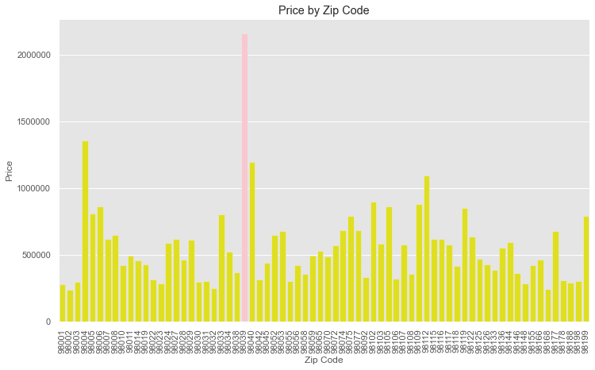
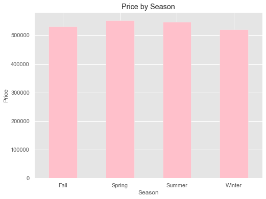
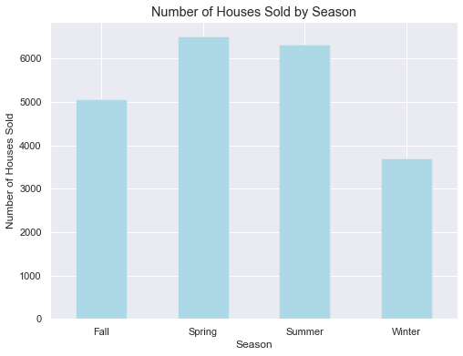
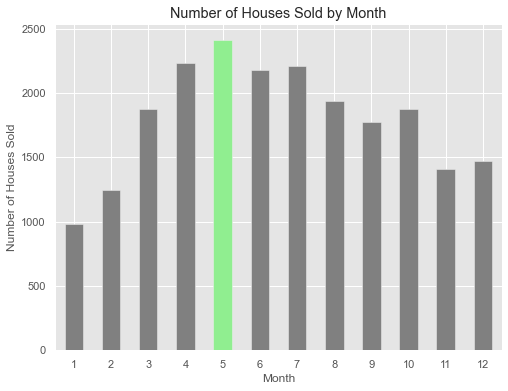
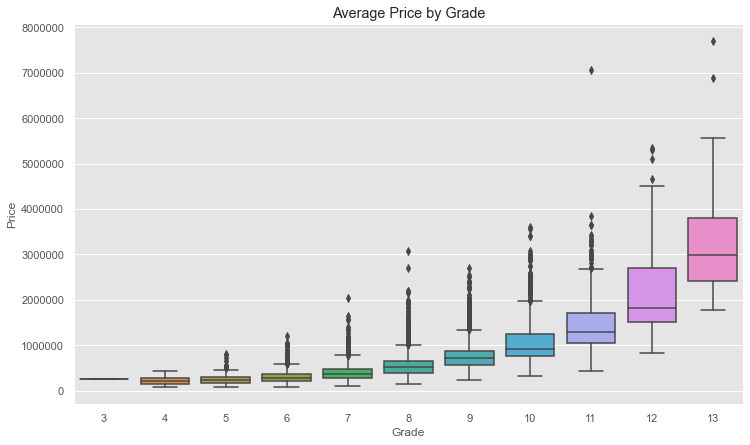
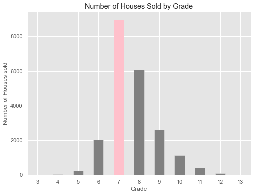
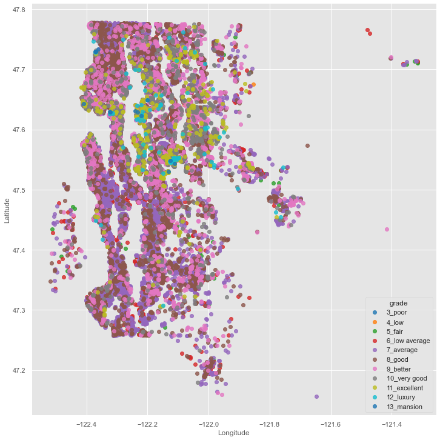
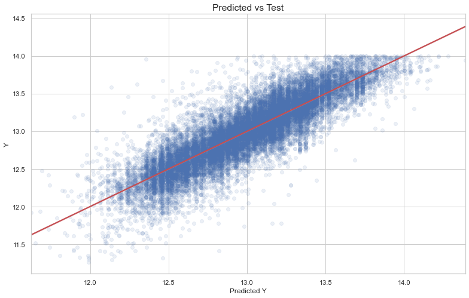

 # King County Housing Price Market Report

The market report is aimed at the home buyers in King County, WA. <br>
The report provides EDA and price prediction model for potential home buyers to make a better decision.<br>


## Most Common Questions Asked by Home Buyers

 - What features affect property value the most? <br>
 - Does season affect house price ?
 - Which season has more choices of houses?
 - Does location have impact on the home price?

## Data
 - 21,597 house records
 - 20 different features
 - From May 2014 to May 2015

Continuous Data
- price
- sqft_living
- sqft_living15
- grade

Categorical Data
- view
- condition
- bedrooms
- bathrooms
- zip code
- seasons

Boolean Data
- with_basement
- waterfront

## Methods

- OSEMN is applied in the report.
- Linear regression models have been built and refined to provide the best predictions for our clients.

## Exploratory Data Analysis

- Through an exploratory data analysis to gain a better understanding of the dataset.
- The data visualizations helped us to learn the features and to communicate with out clients.

## How does location impact housing price?



From above graph, the highest average housing price is in zip code 98039, which is way higher than the 2nd place, which average housing price in zip code 98004.


Light blue to dark red means the housing prices increase.<br>
One observation is that higher housing prices in the North of King County.<br>
Another observation is that higher prices homes are on the waterfront because you can see intensive red dots around the Lake.

### Do seasons impact the housing price?



- Spring has the highest average housing price followed by summer and fall
- There is no big difference of average price within seasons

### Which season or month are houses more available?





More houses are available in spring and summer.<br>
If drill down to each month, more houses are available from March to August.


### Where to find better grade houses and what is the price like in each grade ?



From the above graph, housing prices to increase with a higher grade.<br>
From grade 7 (average) to 10 (good), the median housing price are below $1M.



Average grade houses are the most available followed by good and better.



Luxury and excellent grade houses are on waterfront.

## House Price Prediction Model

The report provides several linear regression models to explain how the features could possibly affect on the housing prices.
- Baseline model with sqft_living
- Add categorial variables like bedrooms, bathrooms, waterfront, view and condition and then eliminate the features with p-value greater than 0.05
- Add zipcode variables, and then eliminate the features with p-value greater than 0.05


## Final Model

Final model can explain 84% of variants in price to predict housing prices in King County



## Recommendations 

- Grade, living space, condition, bathroom impact the housing prices greatly
- Where the house is located determines the price

## Next Step

- In order to provide more thorough analysis and suggestion, some more features could be explored further, like school district, crime statistics, household income, and public transportation
- Mortgage interest rates and  inventory on the market also impact housing prices
- More concrete insights can be reached with a longer period of housing price history


```python

```
